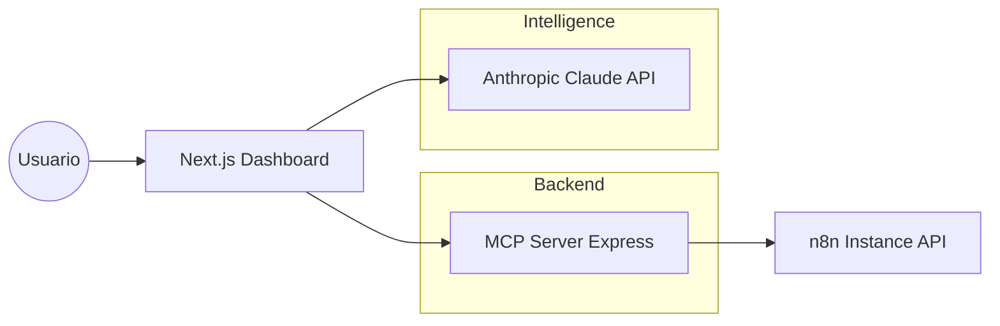

# 🚀 n8n Ops Center


**n8n Ops Center** es un dashboard profesional diseñado para centralizar el monitoreo, la operación y el debugging inteligente de workflows en [n8n](https://n8n.io/). Integrando el poder de la IA y el protocolo MCP, permite no solo ver qué pasa en tus automatizaciones, sino entender por qué fallan y cómo arreglarlas en segundos.

---

## ✨ Características Principales

- 📊 **Dashboard Centralizado**: Visualiza todos tus workflows y su estado actual de un vistazo.
- 🕒 **Historial de Ejecuciones**: Monitoreo en tiempo real de ejecuciones recientes (Éxito, Error, En curso).
- 🔍 **Depuración Profunda**: Detalle técnico de cada ejecución, incluyendo duración, logs y el nodo exacto del fallo.
- 🤖 **AI Error Analysis**: Integración con **Claude Sonnet 4.6** para analizar mensajes de error técnicos, explicar la causa raíz y sugerir correcciones precisas.
- 🔗 **Acceso Directo**: Enlaces inteligentes al editor de n8n para intervenir inmediatamente en los flujos.

## 🏗️ Arquitectura del Sistema

El proyecto implementa un patrón moderno de **MCP (Model Context Protocol)** para desacoplar la lógica de negocio de la interfaz:



### ¿Por qué esta arquitectura?
1. **Seguridad**: La API Key de n8n reside solo en el servidor MCP, nunca se expone al cliente.
2. **Abstracción**: El dashboard consume "herramientas" estandarizadas de MCP, facilitando la escalabilidad.
3. **Performance**: Procesamiento de streams y validación de tipos robusta con Zod.

---

## 🛠️ Stack Tecnológico

- **Frontend**: Next.js 15 (App Router), TypeScript, Tailwind CSS, shadcn/ui.
- **Backend & Proxy**: Express.js con Model Context Protocol (MCP) SDK.
- **Autenticación**: Supabase Auth (SSR).
- **IA**: Anthropic SDK (Claude Sonnet 4.6).

---

## 🚀 Guía de Instalación

### 1. Requisitos Previos
- Instancia de n8n con API v1 habilitada.
- Proyecto de Supabase para la autenticación.
- API Key de Anthropic.

### 2. Variables de Entorno
Clona el archivo `.env.example` como `.env.local` y completa los valores:

```bash
# Supabase
NEXT_PUBLIC_SUPABASE_URL=tu_url
NEXT_PUBLIC_SUPABASE_ANON_KEY=tu_key

# n8n & MCP
N8N_API_KEY=tu_n8n_api_key
MCP_SERVER_URL=http://localhost:3001

# AI
ANTHROPIC_API_KEY=tu_anthropic_key
```

### 3. Instalación de Dependencias

```bash
# Instalar dependencias del root (Dashboard)
npm install

# Instalar dependencias del servidor MCP
cd mcp-server && npm install
cd ..
```

---

## 💻 Ejecución

El proyecto requiere que ambos procesos (Dashboard y MCP Server) estén activos.

### Paso A: Levantar el MCP Server
```bash
cd mcp-server
npm run dev
```
*Por defecto corre en `http://localhost:3001`*

### Paso B: Levantar el Dashboard
```bash
# En una nueva terminal (en el root)
npm run dev
```
*Accede a `http://localhost:3000`*

---

## 📄 Licencia

Este proyecto es parte del curriculum **Full Stack AI Developer**. 
Desarrollado con fines educativos para demostrar la integración de IA y sistemas de automatización.

MIT © 2026.
